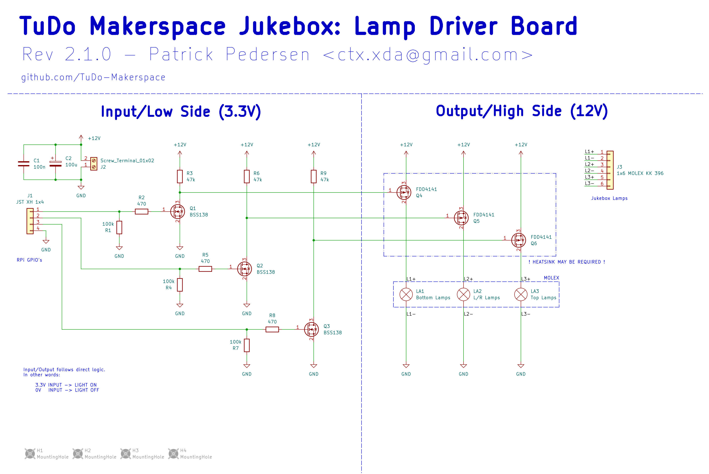
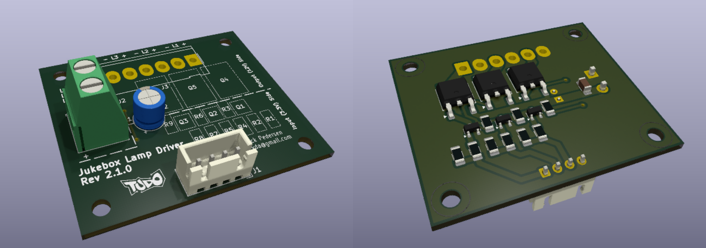
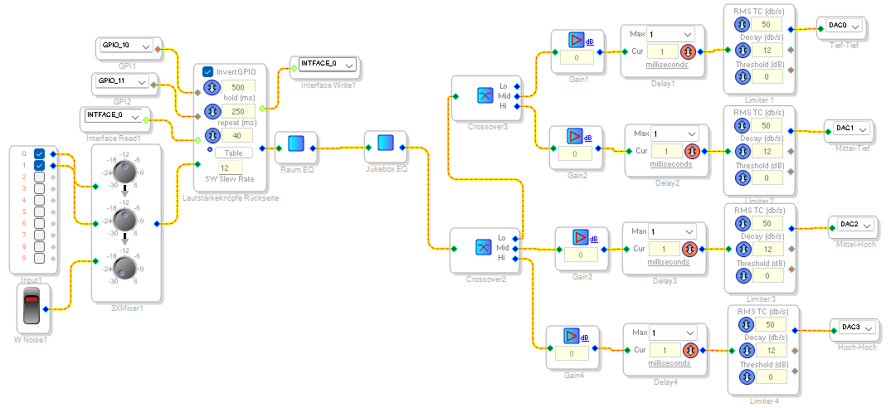

# Hardware

## Jukebox

The original jukebox used in our project is an [NSM Satellite 200](https://www.jukebox-world.de/Forum/Archiv/NSM/NSMSatellite200.htm), likely produced sometime in the late 1980s.

In this document we will only cover the hardware modifications made for our project. For detailed information on the jukebox's original hardware and specifications, please consult the following resources:

- [NSM Satellite 200 on Jukebox-World.de](https://www.jukebox-world.de/Forum/Archiv/NSM/NSMSatellite200.htm)
- [NSM Satellite 200 at Propstore Auction](https://propstoreauction.com/lot-details/index/catalog/359/lot/119259)
- [NSM Jukebox Image Archive on Jukebox-World.de](https://www.jukebox-world.de/Forum/Archiv/NSM/NSM-Bilder-Uebersicht.htm)

## Modifications

Most original components of the jukebox were removed and replaced with modern hardware. The primary modifications include:

- Logic and Playback: The primary logic and audio playback are now managed by a Raspberry Pi. *(TODO: Specify Raspberry Pi model)*
- Speakers: The Original speakers have been replaced. *(TODO: Document exact speaker model/specifications)*
- Audio Processing and Amplification: Audio output is managed by a [WONDOM APM2 DSP Board](https://store.sure-electronics.com/product/AA-AP23122) in combination with two amplifier boards. *(TODO: Specify amplifier board models)*
- Volume Control: The volume adjustment buttons located at the back of the jukebox are directly wired to the DSP board.
- Lighting: The original lighting controller was replaced by a custom lamp driver board which can be driven directly from the Raspberry Pi.
- Keypad Interface: A custom keypad decoder circuit was developed, allowing the Raspberry Pi to interpret user input from the original jukebox keypad.

### Power Supply

The jukebox utilizes two 12V power supplies and two 5V USB adapters to power its components:

- Audio Components: One low-noise 12V power supply provides clean, stable power specifically for audio components.
- Lamps: A separate 12V power supply independently powers the lamps.
- RPi and DSP Board: Two dedicated 5V USB adapters supply power to the Raspberry Pi and the DSP board.

All power supplies are connected to single power strip.

*(TODO: Specify exact power supply models/ratings)*

## Components

The following picture highlights all the components built into the jukebox:

TODO Add picture

Here's the respective block diagram:

### Raspberry Pi

The Raspberry Pi serves as the primary control unit for the jukebox, managing all logical operations and handling song playback. Detailed information about the software running on the Pi can be found in the [software documentation](https://tudo-makerspace.github.io/Jukebox/Docs/Software.html).

To interface with other components, a custom perfboard has been created, which plugs directly into the Raspberry Pi's GPIO pins. This perfboard provides connections to the lamp driver. It also contains the keypad decoder circuit (refer to the Keypad section for more details) along with a connection to the Keypad PCB itself.

Audio output from the Raspberry Pi is routed via its built-in 3.5mm audio jack, which connects directly to the DSP board. Initially, an attempt was made to utilize the I²S interface for improved audio fidelity; however, due to reliability issues arising from the Raspberry Pi's lack of a dedicated master clock, this approach was abandoned. Consequently, the perfboard contains several unused wires that were intended for I²S connections.

Power to the Raspberry Pi is supplied by a dedicated 5V USB adapter through its micro USB port.

### Lamp Driver

The jukebox uses [standard 12V T10 lamps](https://www.amazon.de/dp/B0CBKYPM57?ref_=ppx_hzsearch_conn_dt_b_fed_asin_title_1) distributed across three independently controllable segments:

- Top
- Left & Right (wired together)
- Bottom

To control these segments, a custom lamp driver board was designed to convert the Raspberry Pi’s 3.3V GPIO outputs to 12V control signals. The KiCAD design files are available [here](https://github.com/TuDo-Makerspace/Jukebox/tree/main/Lamps).

The lamp driver receives 12V power from the lighting power supply and connects to the Raspberry Pi via a 4-pin JST connector carrying `GND`, `Top`, `L/R`, and `Bottom` signals. Lamp outputs are routed through a 6-pin Molex connector, with each segment receiving a dedicated `+` and `-` connection. When all lamps are active, the board can draw up to 6A at 12V, with the `L/R` segment being the most power-hungry (up to 3A).

Signal amplification is handled in two stages:
1. The 3.3V GPIO signal is boosted to 12V using a BSS138 N-channel MOSFET.
2. This 12V signal is then used to switch a P-channel power MOSFET that controls the lamp segment.

In the current hardware revision, **TSM7P06CP** P-MOSFETs are used instead of the **FDD4141** parts shown in the schematic. Unfortunately, the TSM7P06CP has a significantly higher RDS(on), which leads to heat buildup under load. Thermal testing has shown temperatures reaching up to 60°C with the current heatsink. While this remains within safe operating limits, we added a layer of Kapton tape between the heatsink and the wooden enclosure as a precaution.

**Recommendation:** For improved thermal performance, we suggest replacing the TSM7P06CP MOSFETs with FDD4141s in a future revision. This can be done either by updating the PCB layout or replacing the components on the current board.

### Keypad

TODO

### DSP

### DSP Board

The jukebox’s audio processing is handled by a [WONDOM APM2 DSP Board](https://store.sure-electronics.com/product/AA-AP23122).

The DSP board primarily functions as a 4-way crossover, splitting the incoming audio signal into four distinct frequency bands:

- Low-Low
- Low-Mid
- High-Mid
- High-High

The board receives stereo audio input from the Raspberry Pi’s 3.5mm jack via its ADC input pins (AINL, AINR) and outputs processed audio through four DAC channels (DAC0–DAC3), which are connected to two separate amplifier boards.

The volume and clear buttons on the back of the jukebox are directly wired to the GPIO pins of the DSP board:

| Button | GPIO Pin |
| ------ | -------- |
| +      | GPIO 10  |
| -      | GPIO 11  |
| Clear  | TODO     |

The volume buttons adjust the gain of the DSP, while the clear button is currently unused.

The DSP configuration is developed and uploaded using [SigmaStudio](https://www.analog.com/en/resources/evaluation-hardware-and-software/embedded-development-software/ss_sigst_02.html). The corresponding project file is available [here](https://github.com/TuDo-Makerspace/Jukebox/tree/main/Sound/DSP).

A dedicated USB programming board is used to upload the SigmaStudio configuration. It can be found inside the jukebox.

Further documentation and details about the DSP board, as well as how to program it, can be found in [this manual](https://files.sure-electronics.com/download/The_correspondence_of_APM2_hardware_and_DSP_program.pdf). [Video tutorials](https://www.youtube.com/watch?v=TjN1SGKeVvw) are also available.

#### Troubleshooting Tips

Here are some common frustrations we encountered while working with the DSP board:

- **USB not recognized (usb device highlighted red):**
    - Power off the DSP board and unplug the programmer
    - Unplug the programmer's USB cable
    - Replug the programmer's USB cable, check for the device to appear green in SigmaStudio
    - Plug the programmer into the DSP board
    - Power on the DSP board (That being said, it should already be powered on through the programmer at this point)

- **EEPROM programming stuck at "Start Download":**
    - Click *Link Project*
    - Click *Link Compile Connect*
    - Finally, click *Link Compile Download*
    - Try flashing the EEPROM again

#### Future Plans

We plan to measure the frequency response of the speakers to implement a tailored equalizer using the DSP board.

### Amplifier Boards

TODO

### Speakers

TODO

