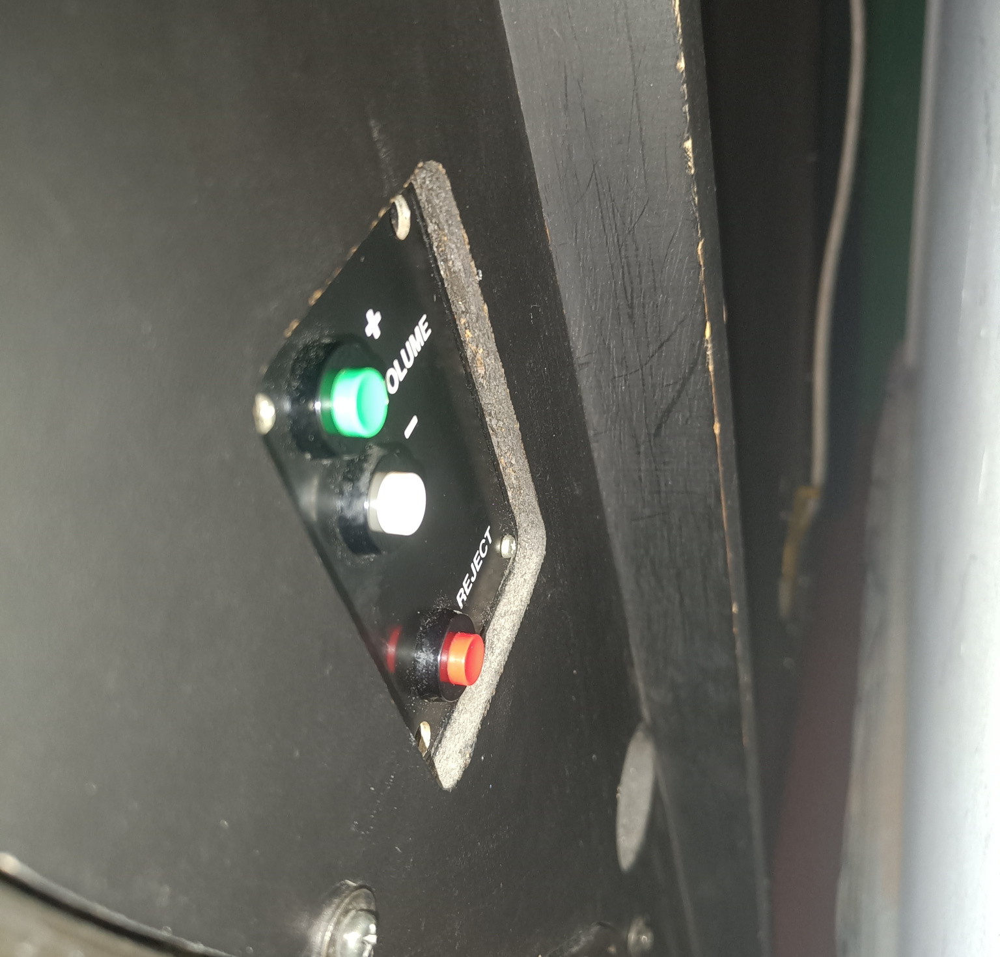

# Usage <!-- omit in toc -->

- [Flowchart](#flowchart)
- [Powering on the Jukebox](#powering-on-the-jukebox)
- [Volume Control](#volume-control)
- [Selecting a Song](#selecting-a-song)
- [Playing a Random Song](#playing-a-random-song)
- [Aborting a Song](#aborting-a-song)
- [Soundboard Mode](#soundboard-mode)
- [Uploading Songs](#uploading-songs)
- [Adding Samples](#adding-samples)

## Flowchart

The following flowchart captures the primary logic of the jukebox. 

Note that the flowchart is simplified and does not reflect all the details of the code. It just serves as a high-level overview of the jukebox's functionality and can be used as a usage reference.

## Powering on the Jukebox

To power the jukebox on or off, flip the switch located on the power strip at the back-left side of the jukebox.

> **Note:** It is normal to hear a loud "pop" sound when flipping the switch.
> 

 
Once powered on, the jukebox will require a short period to boot. It is ready to use when the lights begin flashing.

## Volume Control

At boot, the jukebox will start at its lowest volume. To adjust the volume, use the volume buttons located at the back-right side of the jukebox.

## Selecting a Song

Enter the song number using the keypad. To confirm your selection, press the **`G`** key. The jukebox will begin playing your chosen song.

To cancel your current entry, press the **`R`** key. **Note: Your input will also automatically clear if no keys are pressed for 5 seconds.**

## Playing a Random Song

To play a random song, press the **🔵`(BLUE)`** key. The jukebox will select a random song from its library and begin playing it.

## Aborting a Song

To stop a song currently playing, press the **🔴`(RED)`** key. This will immediately return you to the main menu.

## Soundboard Mode

To activate soundboard mode, press the **🟡`(YELLOW)`** key. In this mode, the keypad functions as a soundboard.

The jukebox has 10 soundboard banks. Upon entering soundboard mode, Bank 1 is automatically selected. Switch between banks using the **🔴`(RED)`** key (Next bank) and the **🔵`(BLUE)`** key (Previous bank).

To exit soundboard mode, press the **🟡`(YELLOW)`** key again. Alternatively, soundboard mode will automatically exit and return to the main menu if no input is detected for 60 seconds.

## Uploading Songs

To upload songs to the jukebox:

1. Connect to the TuDo WiFi
2. Open [`jukebox.local`](jukebox.local) in your web browser
3. Select your desired track number
4. Upload your song either via file or URL (YouTube, Spotify, SoundCloud etc.)

## Adding Samples

This shall remain a secret ;)

